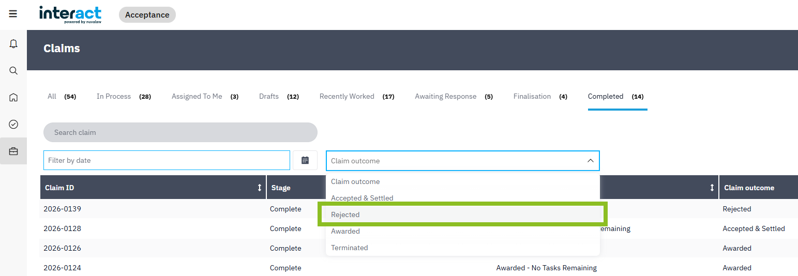
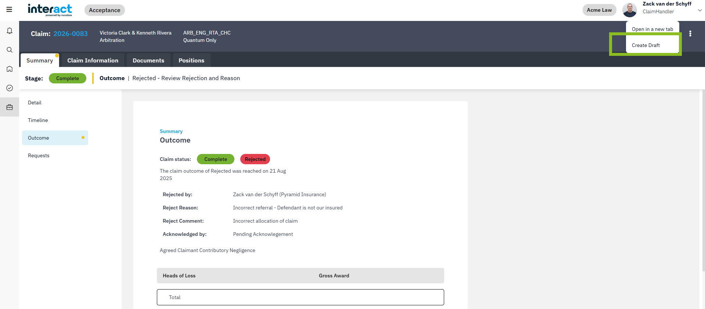

## TL;DR

- **New:** Duplicate any **Rejected** or **Terminated** claim into a **Draft**, make edits, and resubmit.
- **Improvements:** UI polish and performance tune‑ups on the Claims page.
- **FYI:** Minor admin/data updates; no action required.

---

## New: Create Drafts from Rejected or Terminated Claims

Rework rejected/terminated claims without starting from scratch. The duplicated draft preserves context and maintains a clean audit trail linking back to the original outcome.

### How to use it

- Go to **Claims** → open the **Completed** tab.
- Use the **Status** filter above the table and choose **Rejected** (or locate **Terminated** claims as applicable).

- Open the claim and select **Duplicate as Draft**.
- Edit the draft as needed and **Resubmit**.

### What you’ll see

The duplicated draft includes a new **origin data card** on the **Claim Summary** showing the original claim reference and outcome. This makes it easy for reviewers to see the link back to the prior decision.

!!! Note
    Permissions and visibility follow your organisation’s standard settings. No special configuration is required.

## Bug Fixes & Improvements

- General stability, UI polish, and minor workflow fixes to reduce friction during claim review and submission.
- Performance improvements for **Claims** page filters and loading in the **Completed** tab.

Internal references: ENG‑1018, ENG‑1022.

---

## Admin & Data Updates

- Minor admin tooling and data housekeeping to support the new duplicate‑to‑draft flow.
- No user action required; no breaking changes.

Internal references: ENG‑1028, ENG‑1006, ENG‑1023, ENG‑1043, ENG‑1035.

---

## Traceability (Internal)

User‑facing change tickets associated with this release:

- ENG‑56, ENG‑1016, ENG‑436, ENG‑1036, ENG‑1021, ENG‑1038

---

For support, contact us at {{ support }}.
