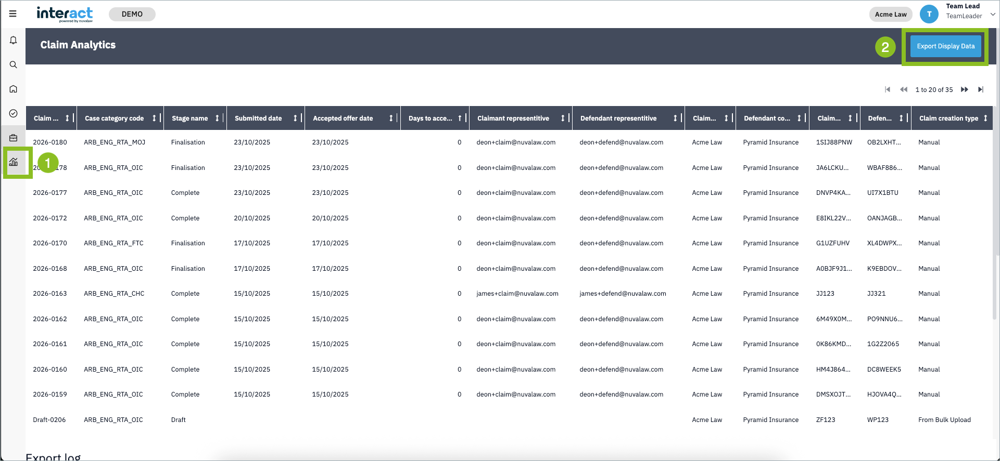
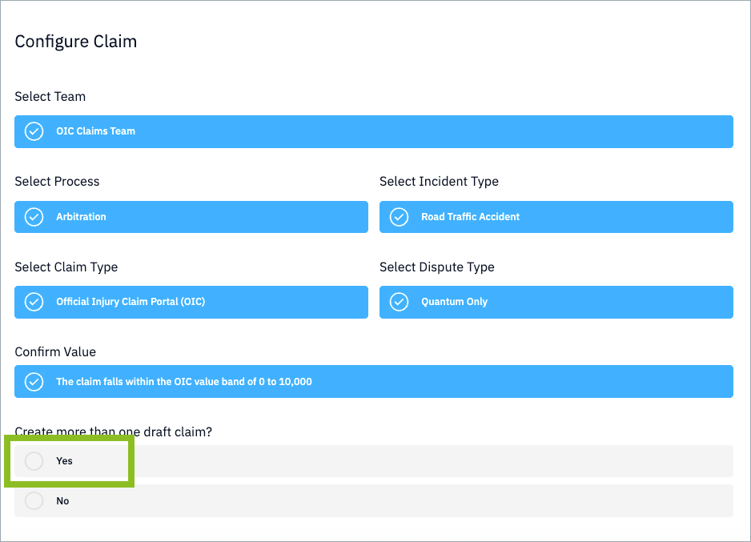
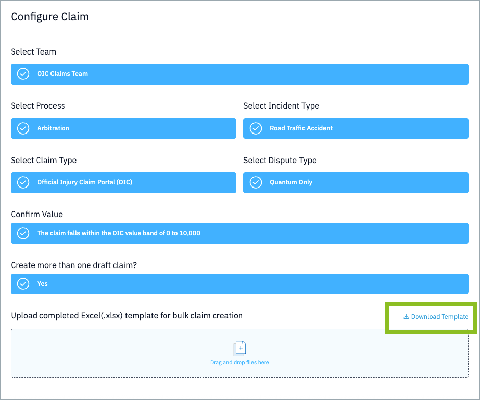
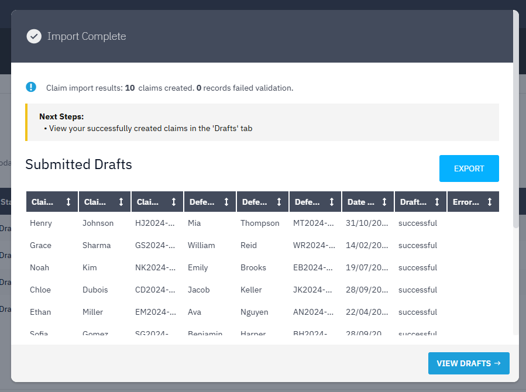
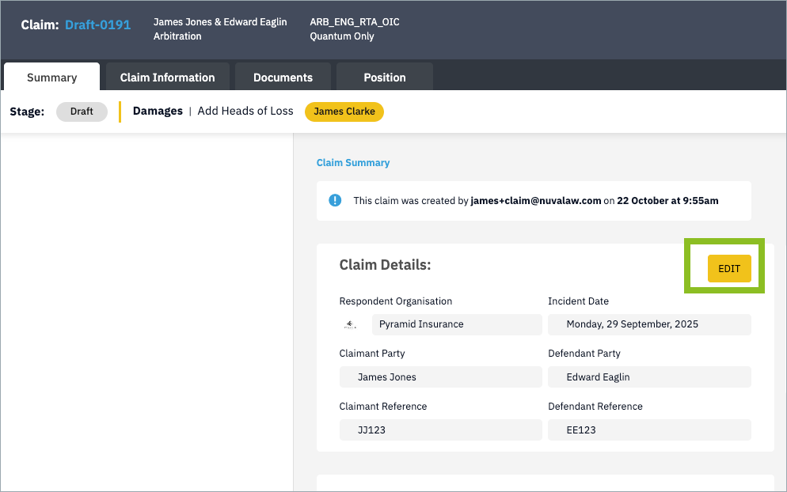
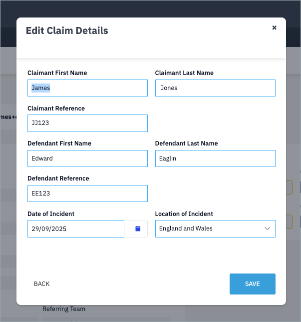

## TL;DR

- **New:** Claim Analytics page with downloadable reports for team leaders.
- **New:** Bulk claim creation via Excel upload for streamlined workflow.
- **Improvements:** Claim details now editable during draft process, and liability percentage added to award templates.
- **Admin:** Invoice restoration capability and feature flag management introduced.

## New & Updated Features

### Claim Analytics Page

Team leaders now have access to a new 'Claim Analytics' page in their left-hand navigation. This feature provides a comprehensive overview of all claims and their current positions in a single view, enabling better work management and informed decision-making. Reports can be downloaded, and a historical record of previous downloads is maintained for reference.

### Bulk Claim Creation via Excel Upload

We're taking steps toward smoother integration with your claims management system. While a full integration is on the horizon, you can now create multiple claims simultaneously by uploading an Excel file (.xlsx) containing claim details.

When creating a claim with a specific counterparty, you can select if you wish to upload a list of claims in bulk and upload a spreadsheet with claim information.

To download the template, click 'Download Template' and populate the rows. Ideally you would configure your case management system to export these columns in the correct format for the claims you wish to process.

Interact will generate a draft claim for each row in the file, providing you with a list of draft claims to review and process. (This itself can be downloaded as an Excel file.)

This feature allows you, for example, to efficiently upload and create drafts for all your claims against one counterparty at the start of the week.

### Editable Claim Details in Draft Process

Users can now edit claim details directly from the summary tab while working on draft claims, providing greater flexibility during the claim creation process.

### Award Template Enhancement

All award documents now include the liability percentage, ensuring comprehensive documentation of claim outcomes.

## Bug Fixes

- Resolved draft creation validation issues that were causing failures in certain cases.
- Invoice generation failures have been addressed, with admin capability to restore missing invoices.

Internal references: ENG-1082, ENG-990

## Admin Updates

### Claim Analytics Query Update

The claim analytics query has been refined and is now available for client reporting purposes.

### Invoice Restoration Tool

Nuvalaw admin users can now restore invoices to claims where PDF invoice generation previously failed.

### Feature Flag Management

Claim Analytics is now managed through feature flags, and administrators have the ability to manage global feature flags across the platform.

Internal references: ENG-1012, ENG-990, ENG-913, ENG-1041

## Data Fixes

No managed data changes required for this release.

## Traceability (Internal)

**User-facing change tickets associated with this release:**

ENG-449, ENG-1032, ENG-1093, ENG-1079, ENG-1041

**Bug fixes:**

ENG-990, ENG-1082

**Admin updates:**

ENG-1079, ENG-990, ENG-913, ENG-1041, ENG-1012

For support, contact us at [{{ support }}](mailto:{{ support }}).
