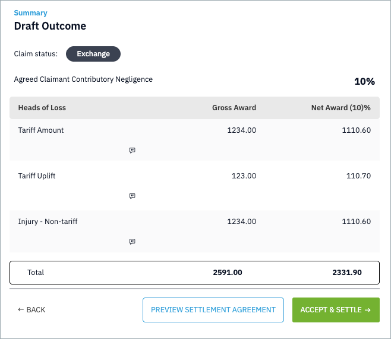
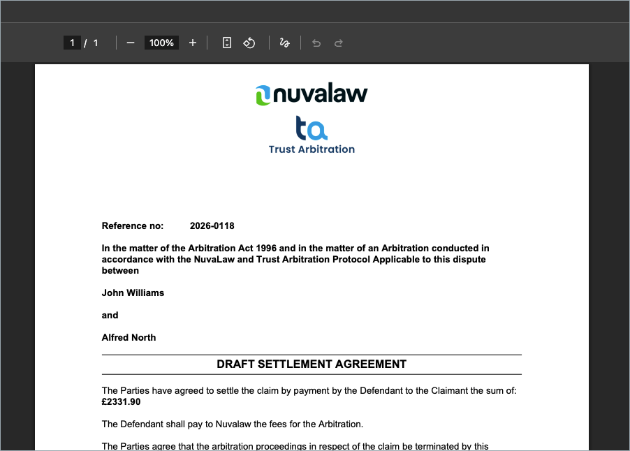

## Accept and Settle a Claim

You can resolve a claim immediately by accepting and settling it.  

Click the **Accept and Settle** button in the top-right corner of the screen. A draft outcome of the claim will be displayed.

To preview the Settlement Agreement that will be generated, click **Preview Settlement Agreement**.  

A PDF version of the agreement will open in your browser.  

To return to the main claim view, click **Back**.
