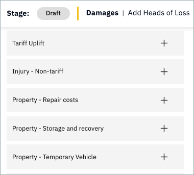

To add a head of loss, click on it in the left hand panel where it is listed.

!!! Note
    This list changes per product. For example, the heads of loss shown here relevant to the {{ oic_protocol }} are different to those relevant to those that apply for the {{ moj_protocol }}. 

---

