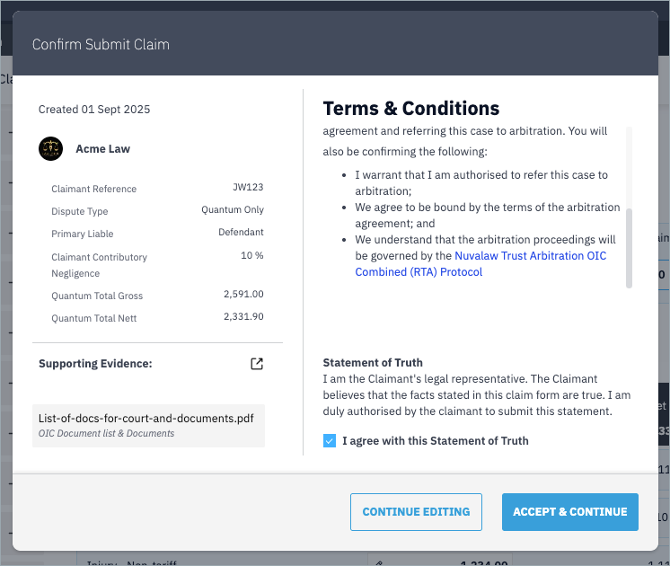

To submit the claim for arbitration, click the 'Submit' button. You will be presented with the confirmation and contracting modal.

Here you will see a high-level summary of the claim you have prepared, including any evidence that you have linked. 

Check the Statement of Truth and click "Accept & Continue" or "Continue Editing" if you wish to correct or amend something.

Once you have confirmed, the claim will proceed to the defendant for their review.

---
