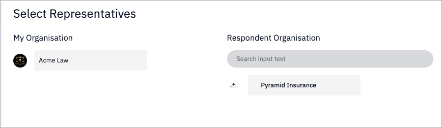
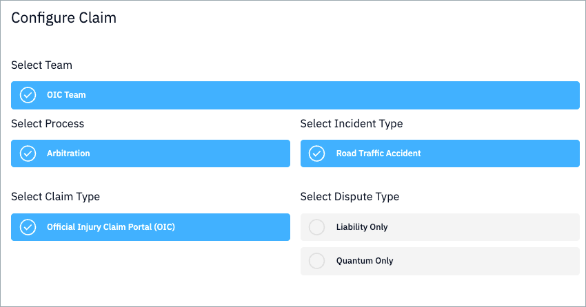
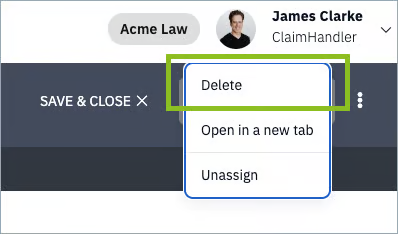

## Create Draft
To create a draft claim, navigate to the homepage and click “Create Claim +”.

Your organisation will be selected by default under “My Organisation”. Select the respondent organisation from the list shown. 

(Organisations will be pre-loaded by Nuvalaw. If the organisation you are looking for is not shown on the list, please contact support@nuvalaw.com)

Click “Configure” to proceed to claim configuration.

## Select Referring Team
You will be presented with a list of the teams from which you can refer claims. Select the appropriate team based on you organisation set up. For example, in your organisation you may handle claims by type ("OIC Team" or "MoJ Team") or by opponent ("Insurer ABC Team" or "Law Firm XYZ Team"). 

Depending on the set up and operating model of your teams, which will have been carried out by the Nuvalaw Interact Administrator.

Having selected the team, all the other settings will populate automatically based on your organisation preferences.

Click "Claim Details" to proceed to the claim details capture and capture the required data. When you click "Create Draft" you will see a success modal summarising the data you have captured. 

## Populate and Submit Draft
Upon creation of the draft, a task is created for you to complete it. By default, Interact sets drafts as due in two weeks. 

If you do not wish to proceed with a draft, you can delete it by clicking on the kebab menu (three dots) on the top right hand corner of your screen when you have the claim open.

!!! Note
    Deletion is final and no record is kept of your deleted drafts.

Having created a draft claim, you can begin to populate it with all the required documentation and data.

---
{# Next logical section: Upload Evidence #}

