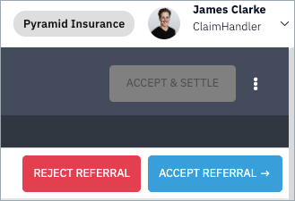
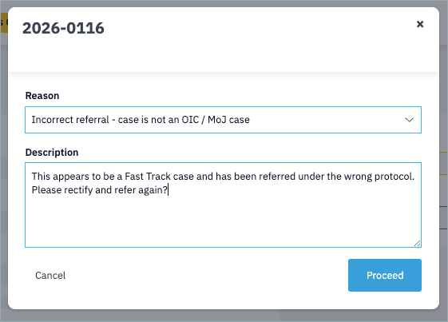
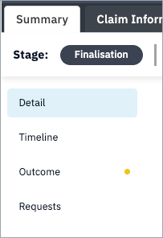

To accept a claim, assign the task to yourself and click on the claim to open it. Then click the "Accept Referral" button.

You will then be presented with a confirmation and contracting modal. Confirm to accept the claim.

If you wish to reject the claim, you can click the "Reject Referral" button.

You will be required to select from a dropdown list the reason for your rejection and to provide a justification in the text box. 

A certificate of case status will be written to the case record indicating your reasons for the rejection. This is available for download under the outcome sub-tab of the claim summary tab. 

---