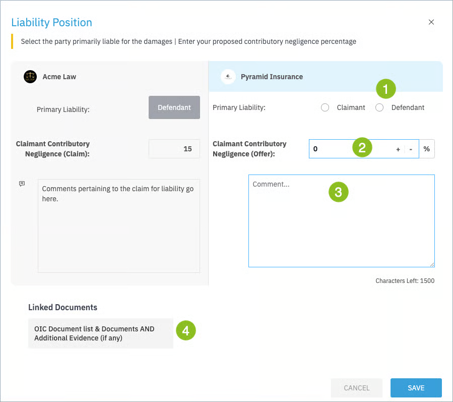

Open the offer by clicking on the “Offer +” button and capture your position on liability.

First, make a selection primary liability [1]. If you believe the claimant is liable, select the radio button for “Claimant”. If you select this option, contributory negligence will automatically set to 100% and become uneditable.

If you agree that primary liability lies with you as the defendant, click “Defendant” and set your position on the claimant’s contributory negligence [2]. 

You may add a comment in connection with your offer [3]. All documents linked by the claimant to their offer will be shown, as well as any comments they have made [4].

Once ready, click the “Save” button.

