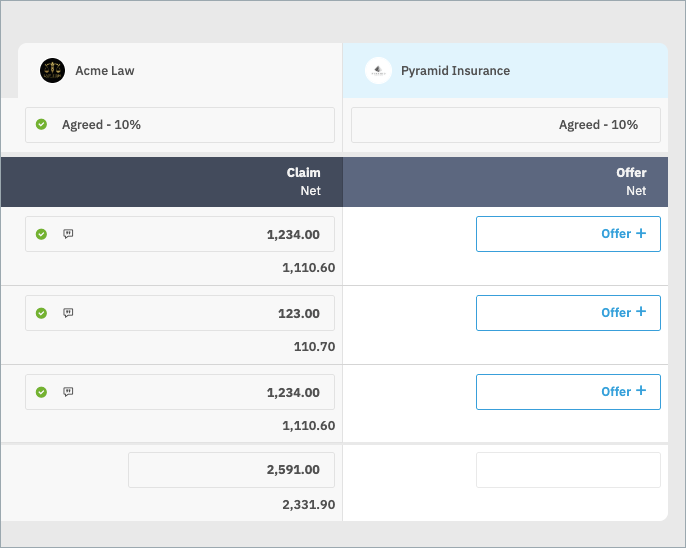
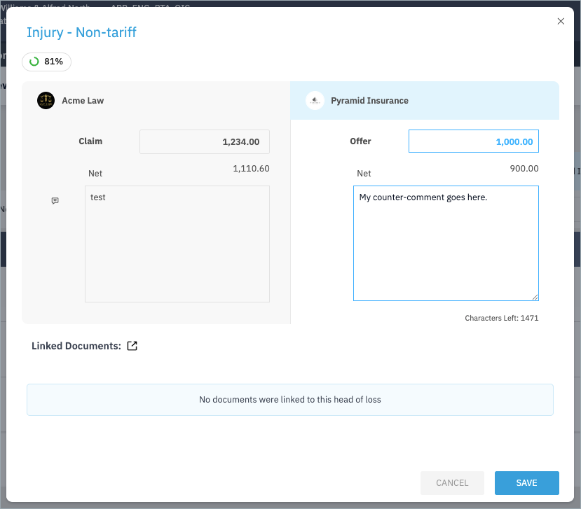
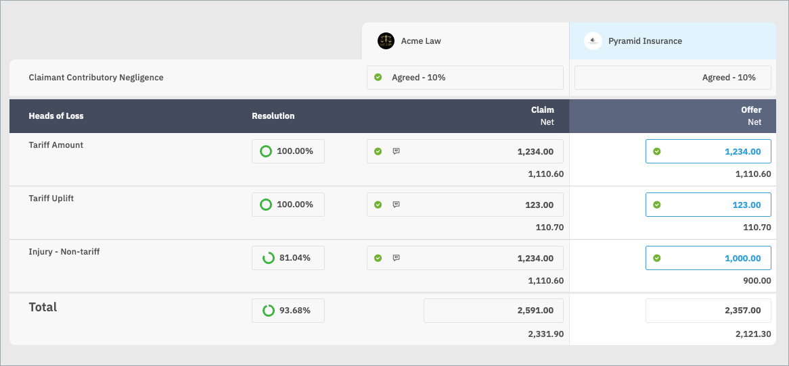

To capture your offer, open each head of loss in Positions tab.

Here you can see details of the claimant's offer for this head of loss, as well as any particular documents the claimant linked to their offer.

A resolution percentage is shown for each head of loss and the total. The figure below the offer is the nett total, which is calulated based on the agreed contributory negligence.

---
