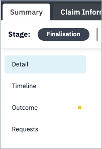
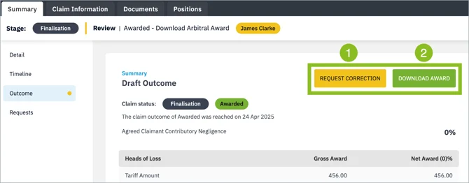

To download the award, assign the task to yourself and navigate to the outcome sub-tab of the claim summary tab.

Click Download Award [2] to download it and complete your task.

You can click Request Correction [1] if the award contains any clerical error. For more information, read the support article on correct requests.

Simultaneously, the award is made available for later download from the Outcome sub-tab and Documents tab.

It is also available under the Documents tab with all other claim documents.

!!! Note
    The claim will remain in the Finalisation stage for an Objection Period of 10 days. In the case that you fail to complete the task to download the award within the 10 day period, it will be completed for you by the system and the claim will be invoiced as normal.

---
