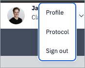
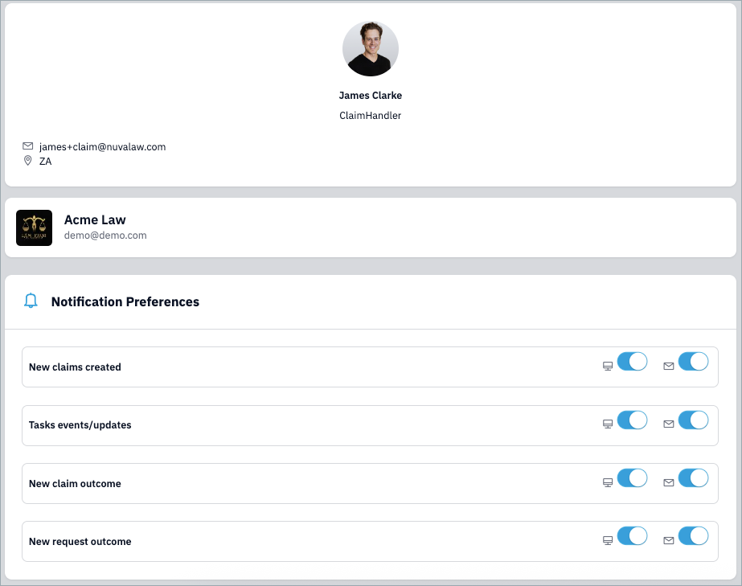

Interact sends notifications based on claim activity. Since claims are managed by teams (not owned by individuals), you’ll receive notifications linked to the teams you belong to. This means you’ll see updates for any claim activity within your team(s).

To manage your notifications:

1. Open the user menu.
2. Click Profile.

In your profile, you can turn in-app and email notifications ON or OFF for each category.

Example: If you only want emails when a claim outcome is issued (e.g. rejected, terminated, or awarded), switch OFF all other categories and leave that one ON.

!!! Note
    We recommend keeping notifications ON by default. Only switch off categories you know you don’t need.

---
