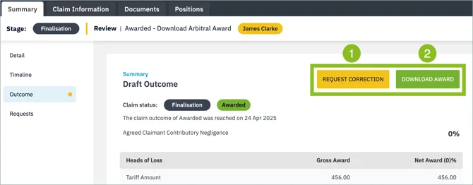
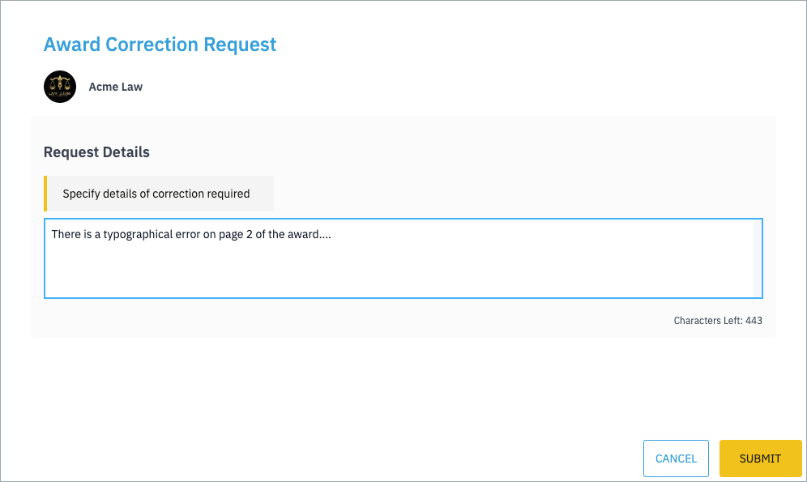
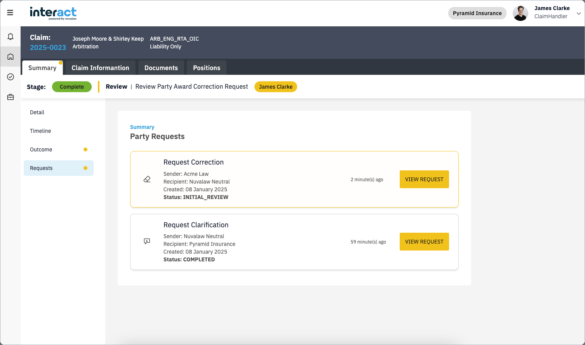
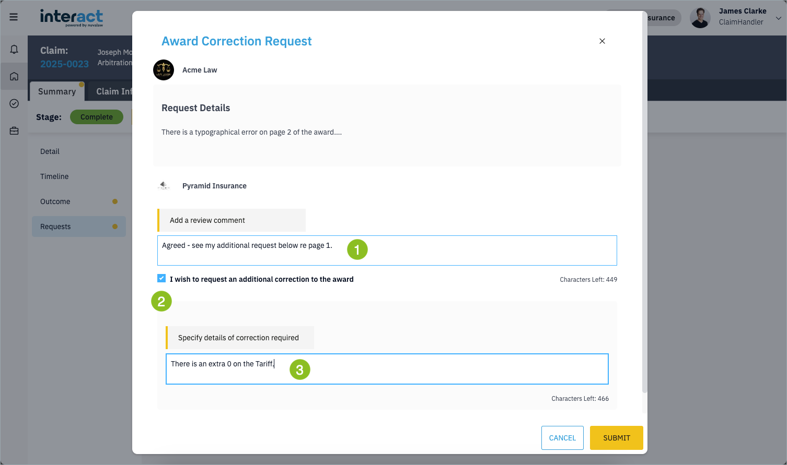

## Request an Award Correction

If you notice a clerical error or mistake in an award, you may request that the arbitrator correct it.

!!! Note
    A correction request cannot be used to introduce new evidence or to appeal the award. If you are unsure of the rules, please refer to the relevant protocol.

### Submitting a Correction Request

1. Go to the **Claim Summary** tab and open the **Outcome** sub-tab.  
2. Click the yellow **Request Correction** button.

Enter the details of your request and click **Submit**.

After submission:

- You will receive a confirmation.  
- A notification is sent to the other side for review and response.  
- The other side may also choose to submit their own correction request (see below).  

If the other side does not submit a request, your correction (with their review, if any) will go directly to the arbitrator. If they do submit their own request, it will first be sent to you for review before being passed on to the arbitrator.

### Reviewing a Correction Request

Go to the **Claim Summary** tab and open the **Requests** sub-tab.

1. Click **View Request**.
2. Assign the task to yourself to respond.  
3. Enter your response details [1]  

If you also wish to make a correction request:

- Select the checkbox **I wish to request an additional correction to the award** [2].  
- A new text box will appear where you can enter your request to the arbitrator [3].

The other side will receive a task to review and respond to any additional request. The complete exchange is then sent to the arbitrator.

### Arbitrator’s Response

- If the arbitrator **rejects** the request, both parties will be notified.  
- If the arbitrator **accepts** the request, they can edit and republish the award. You will receive a notification and a task to download the revised award.  

The original award will be marked as **Withdrawn**. Once you complete the download task, both the revised and withdrawn awards remain accessible under the **Documents** tab and the **Outcome** sub-tab of the **Claim Summary** tab.
