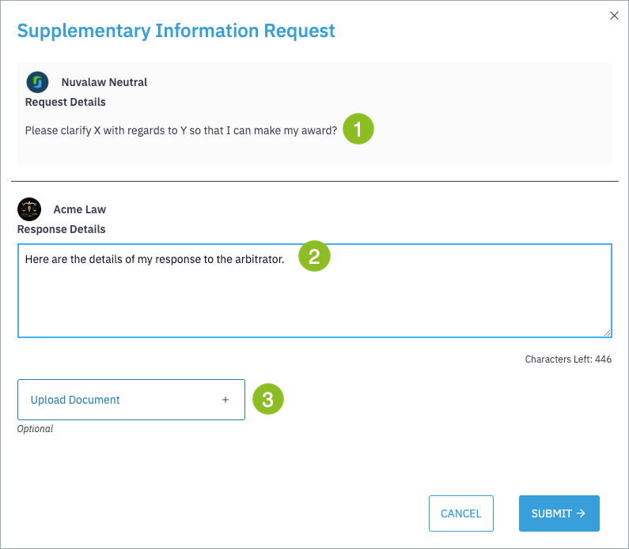
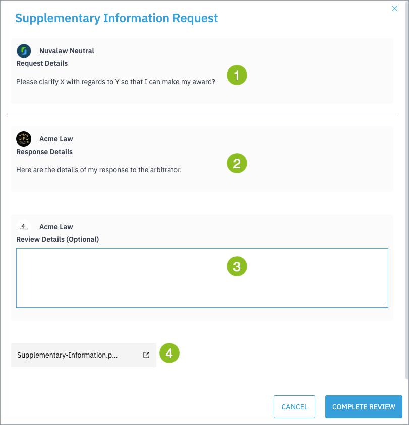

The arbitrator may request a party to supply supplementary information to clarify:

- a claim made by the claimant; or
- a response made by the defendant.

!!! important
    This process **cannot** be used to introduce new evidence. Parties are **not entitled** to provide additional evidence in response to a clarification request.

## Reviewing the Arbitrator’s Request

You will receive a task: **Review Arbitrator Request For Supplementary Information**.

To review and respond:

1. Assign the task to yourself.
2. Go to **Claim Summary → Requests**.
   - A yellow dot on the tab indicates new items to review.
3. Click **View Request**.

On the request screen:

- The arbitrator’s request appears at the top [1]
- Enter your response in the provided field [2]
- (Optional) Upload a supporting document [3]

!!! note
    The arbitrator will not proceed with the award until you have responded **or** the response deadline has passed. After you submit your response, it is sent to the other party for review before returning to the arbitrator.

## Reviewing a Party’s Response

To review the other party’s response to the request:

1. Assign the task to yourself.
2. Go to **Claim Summary → Requests**.
3. Review:
    - the arbitrator’s original request [1]
    - the other party’s response [2] and
    - the field to provide your own response (if required) [3].

You can also open any attached documents. When you complete your review, the task returns to the arbitrator, who may then continue preparing the award.
