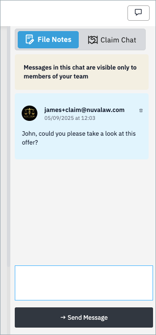

Messaging allows you to communicate and record information within a claim. There are two types of messages: **File Notes** and **Claim Chat**.

## Accessing messaging

1. Go to the **Positions** tab of the claim.  
2. Click the **Messaging** icon to open the messaging drawer.

## File Notes

- Shared only among members of **your team**.  
- Used to record relevant information for internal reference.  
- Not visible to the other party or the arbitrator.

## Claim Chat

- Visible to **all parties** to the claim, except the arbitrator.  
- Used to communicate directly with your counterparty.  

## Sending messages

- Use the **message type selector** to choose between File Note and Claim Chat.  
  - The selector button shows as **blue** when active.  
- Enter your message and click **Send**.

## Deleting messages

- If you send a message in error, click the **bin icon** (right side of the message) to delete it.  
- You have up to **five minutes** to delete a message.  

!!! note
    After five minutes, the message becomes part of the official case record and cannot be changed or removed.
