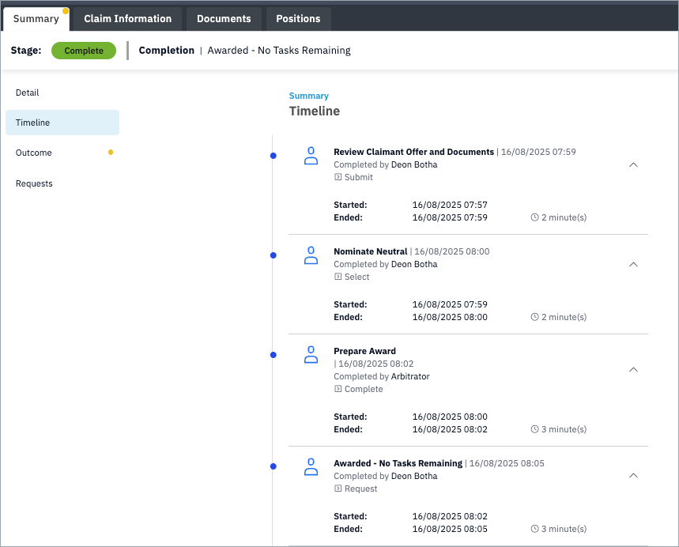

# Timeline

The **Timeline** provides a chronological record of all actions and events that occur within a claim. It helps parties, administrators, and arbitrators track progress and confirm the sequence of activities.

## Purpose

- View a detailed history of claim activity.  
- Confirm who performed each action and when.  
- Track durations between actions to understand case progress.  
- Provide transparency for both parties and the arbitrator.

## Key Features

- **User and role** — Shows who completed each action (e.g. Claimant, Defendant, Arbitrator).  
- **Action type** — Describes the step (e.g. Review Offer, Nominate Neutral, Prepare Award).  
- **Timestamps** — Displays start and end times down to the minute.  
- **Duration** — Indicates how long the step took to complete.  
- **Status** — Shows whether the step is complete, pending, or in progress.

## Example Actions

Typical entries in the timeline may include:

- **Review Claimant Offer and Documents** — Completed by a party after reviewing submitted evidence.  
- **Nominate Neutral** — Indicates when a neutral arbitrator has been appointed.  
- **Prepare Award** — Shows when the arbitrator has drafted the award.  
- **Awarded – No Tasks Remaining** — Marks the formal completion of the case.

## Using the Timeline

1. Open the **Summary** tab of the claim.  
2. Select **Timeline** from the left-hand menu.  
3. Review the listed events in order, with the most recent at the bottom.  
4. Expand individual items to see start and end times, user, and duration.  

!!! Tip
    Use the timeline as an audit trail. It can be especially useful if you need to confirm when a decision was made or check the sequence of submissions.