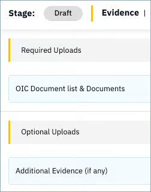
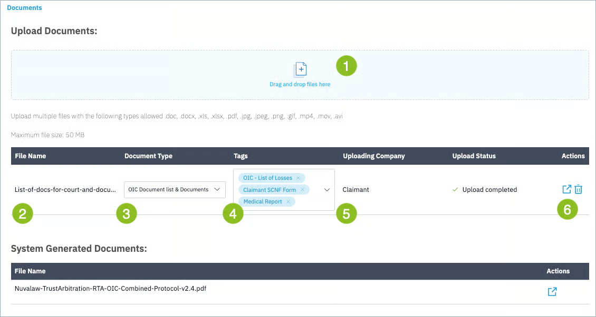

Under the “Documents” tab, upload the required and any optional documents in support of the claim. 

!!! Note
    Documents required during upload are defined in the product protocol. In most cases, these are defined non-prescriptively, with the parties called upon to supply any allowed documents upon which they wish to rely arguing their case.

A list of the required and optional documents is shown on the left hand side of your screen.

You can upload multiple documents by drag and drop [1] or one by one.

Your uploaded document must be given a type from the Document Type dropdown list [3] and the required upload document types must be used in order to refer the claim. This is to ensure that you proactively confirm you have uploaded those documents required by the process.

You can optionally add tags [4] from a pre-defined list to give more metadata to your upload. The party who uploaded the document is recorded as well, in this case "Claimant" [5]. To view or delete the document, use the action buttons on the right [6].

Having uploaded your documents, click the blue action button on the bottom right of your screen labeled “Next: Position” to continue.

---
{# Next logical section: set liab position #}